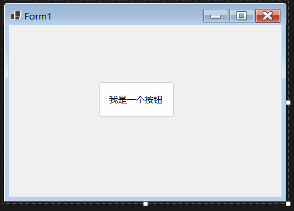
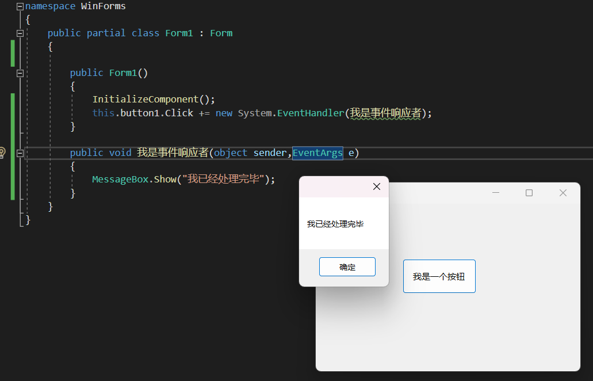
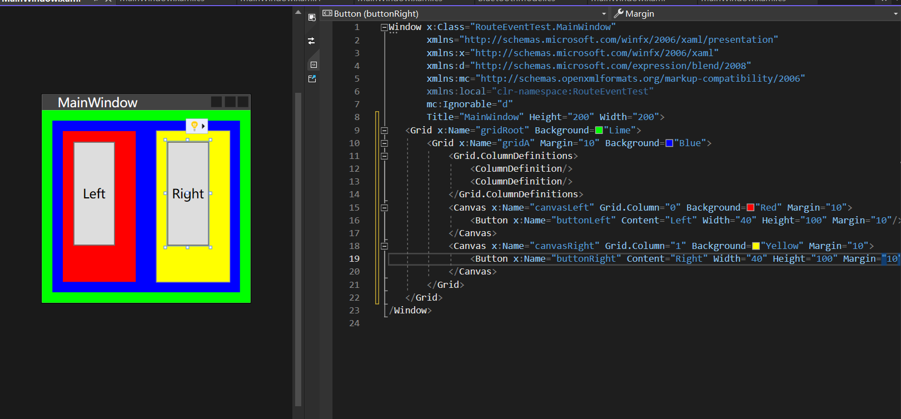
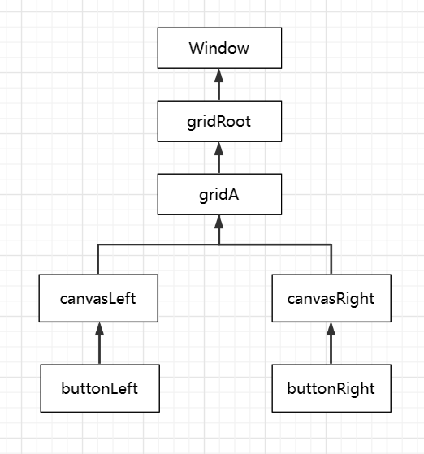
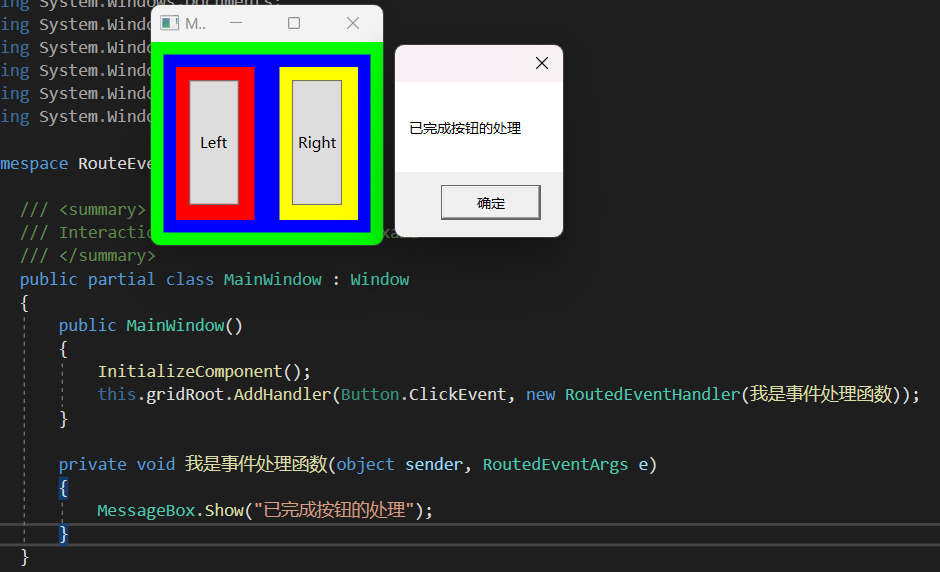
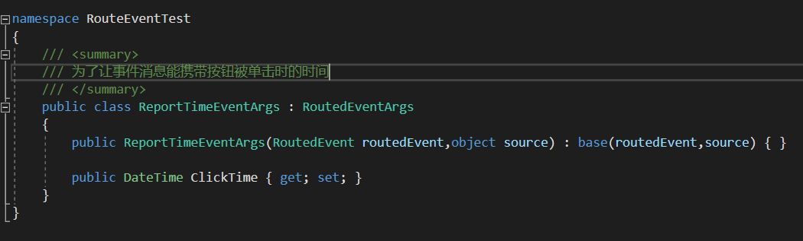
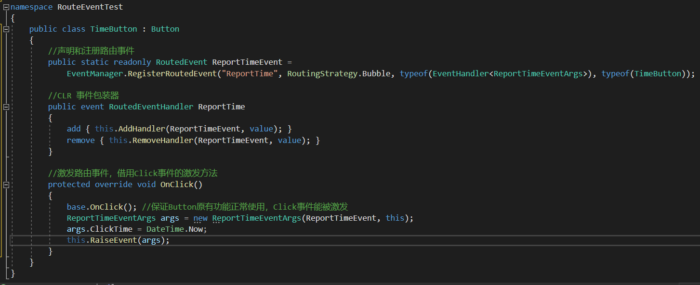
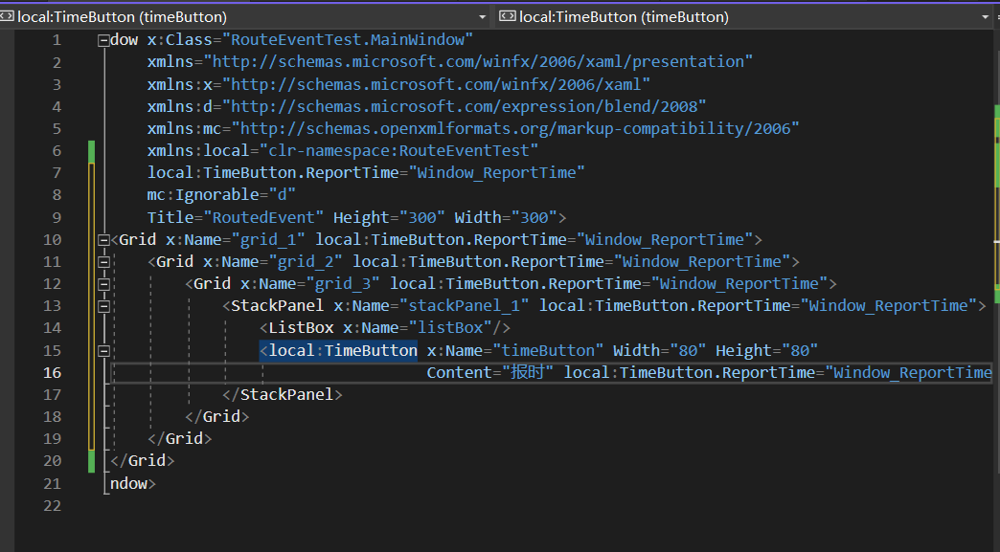
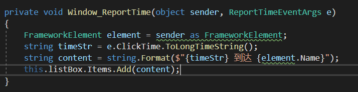
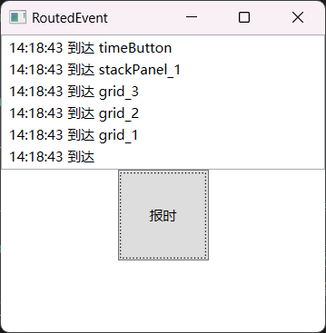

# 事件

Windows是消息驱动的操作系统，运行在上面的程序也是按照这个机制运行。

**消息处理流程（消息驱动）**：

- 如：点击鼠标左键时，一条名为左键按下的消息就被生成并加入消息队列中等待处理，当Windows处理到这条消息时会把消息发送给你单击的窗体，窗体会用自己的一套算法来响应这个消息（窗口处理函数）。这个消息还可能会携带参数。

**消息驱动的缺点**

- 入门Windows开发的门槛太高
- 大型Windows程序的开发和维护成本高


在.NET中消息被封装为事件

一、什么是事件

事件就是一个控件发生了某种行为后产生的消息。比如一个按钮，当点击它时就会触发按钮的单击事件。可以用事件处理函数来处理它。

从WindowsAPI开发到传统的.NET开发，消息的激发和响应都是直接式的，即消息直接由发送者交给接收者，而在WPF中可以选择使用这种直接事件模式，也可以使用路由事件，即让这个事件在UI组件树沿着一定的方向传递且路过多个中转结点，并在这个路由过程中被恰当地处理。


消息驱动在事件模型中被简化成3个点

- 事件的拥有者（消息的发送者）
- 事件的响应者（消息的接收者、处理者）接收者使用事件处理器（Event Handler）对事件做出响应。
- 事件的订阅关系：事件拥有者可以随时激发事件，但有没有响应要看有没有事件的响应者（对象A关注对象B的某个事件是否发生，即A订阅了B的事件），事件实际上是一个使用event关键字修饰的委托类型成员变量，事件处理器则是一个函数，**A订阅B本质上就是让B.Event 与 A.EventHandler关联起来**。事件激发就是B.Event被调用，这里与其关联的A.EventHandler就会被调用。

事件的响应者通过订阅关系直接关联在事件拥有者的事件上，称为直接事件模型或CLR事件模型。CLR事件本质上是一个用event关键字修饰的委托实例。






点击按钮时触发点击事件，事件响应者函数得到响应就会调用。一个事件可以绑定多个事件处理函数。


直接事件模型很大程度上简化的程序的开发，但也有一些缺点：

* 每对消息是“发送->响应”关系，必须建立显式的点对点订阅关系
* 程序运行期在容器中动态生成一组相同控件，每个控件的同一个事件都使用都使用同一个事件处理器来响应，面对这种情况，我们在动态生成控件的同时就需要显式书写事件订阅代码。
* 事件的宿主必须能够直接访问事件的响应者，不然无法建立订阅关系。这样会导致代码的耦合性高，灵活性低，难以实现动态生成控件或用户控件的内部事件向外界暴露。当模块划分很细的时候，UI组件的层级会很多，如果想让外层的容器订阅深层控件的某个事件就需要为每一层组件定义用于暴露内部事件的事件，形成事件链。

路由事件的出现很好地解决了上述两种情况中出现的问题。


# 路由事件

一、什么是路由事件

为了降低由事件订阅带来的耦合度和代码量，WPF推出了路由事件机制。

路由事件和直接事件区别：

- 直接事件：被激发时直接将消息通过事件订阅交给事件响应者
- 路由事件：事件拥有者和响应者没有直接显式的订阅关系，拥有者只负责激发事件，由谁响应它并不知道，**事件响应者则安装有事件侦听器**，针对某类事件进行侦听，当有此类事件传递至此时事件响应者就使用事件处理器（侦听者并不关心是哪个对象的哪个事件）来响应事件并决定事件是否可以继续传递。比如单击一个按钮时，按钮就触发了一个单击事件，然后就会在沿着路径(Tree)找，当事件经过某个结点时如果这个结点没有安装用于侦听这个点击事件的侦听器，那它就会无视这个事件，让它畅通无阻的继续找，如果某个结点安装了侦听器，它的事件处理器就会被调用（侦听者并不关心具体哪个Button的单击事件被传来）
- 在事件处理器内程序员可以查看路由事件原始的出发点是哪个控件、上一站是哪里，还可以决定是继续传递还是到此为止。

WPF中既支持直接事件模型也支持路由事件机制。路由事件是沿着 VisualTree 传递的。

VisualTree 和 LogicalTree 的区别：LogicalTree 的叶子结点是构成用户界面的控件，而 VisualTree 要连控件中的细微结构也算上。


二、路由事件的优缺点

优点：

- 可以实现控件组合和封装，使得子元素的事件可以被父元素或其他元素捕获和处理。
- 可以使用单一处理程序附件点，简化事件处理程序的注册和管理。
- 可以创建自定义路由事件，扩展 CLR 事件的功能

缺点：

- 可能会导致性能下降，因为路由事件需要遍历元素树，并且可能会触发多个处理程序
- 可能会导致逻辑混乱，因为路由事件的源元素和发送者元素可能不一致，而且可能会被中途截断或修改。
- 可能会导致命名冲突，因为路由事件需要在全局范围内注册，并且需要遵循一定的命名约定


三、如何使用路由事件





当单击 buttonLeft 时，Button.Click 事件就会沿着 buttonLeft -> canvasLeft -> gridA -> gridRoot -> Window这条路线向上传送，目前还没有哪个控件侦听Button.Click 事件，所以单击按钮后尽管事件向上传递却并没有受到响应。接下来为 gridRoot 安装针对 Button.Click 事件的侦听器。



* AddHandler 方法源自 UIElement 类，所有UI控件都具有这个方法。WPF的事件系统也使用了与属性系统类似的“静态字段->包装器”的策略。路由事件本身是一个RountedEvent 类型的静态成员变量，Button还有一个与之对应的Click事件（CLR包装）专门用于对外界暴露这个事件。

* 由于路由事件（的消息）是从内部一层一层传递出来最后到达最外层的 gridRoot，并且由 gridRoot 元素将事件消息交给事件处理函数进行处理，所以传入事件处理函数的参数sender实际上是gridRoot而不是Button按钮。可以使用e.OriginalSource 查看事件的源头。

* 在XAML中可以这么添加路由事件

* ```XAML
  <Grid x:Name="gridRoot" Background="Lime" ButtonBase.Click="事件处理函数"/>
  ```


## 自定义路由事件

为了方便程序中对象之间的通信常需要我们自己定义一些路由事件。

自定义路由事件大体分为三个步骤：

* 声明并注册路由事件
* 为路由事件添加CLR事件包装，是为了让路由事件看起来像传统的直接事件，可以使用+-操作符添加和删除事件处理器。
* 创建可以激发路由事件的方法。

激发路由事件：首先创建需要让事件携带的信息（RoutedEventArgs类的实例）并把它与路由事件关联，然后调用元素的 RaiseEvent 方法（继承自 UIElement 类）把事件发送出去。这与激发传统直接事件的方法不同，传统直接事件的激发是通过调用CLR事件的Invoke()方法实现的，而路由事件的激发与作为其包装器的CLR事件毫不相干。

```C#
//声明并注册路由事件
public static readonly RoutedEvent ClickEvent = 			EventManager.RegisterRoutedEvent("Click",RoutingStrategy.Bubble,typeof(RoutedEventHandler),typeof(ButtonBase));
```

* 第一个参数是 string 类型，被称为路由事件的名称。底层算法和依赖属性类似，需要使用这个字符串生成用于注册路由事件的Hash Code，所以这个字符串不能为空。
* 第二个参数为路由事件的策略，WPF路由事件有3种路由策略
  * Bubble：冒泡式：路由事件由事件的激发者出发向它的上级容器一层一层路由，直至最外层容器。由树底向顶端移动且只有确定的一条路径。
  * Tunnel：隧道式：与Bubble相反，由UI树的树根向事件激发控件移动。从UI树根向树底移动时有很多路径，但我们只希望是由树根向激发事件的控件移动，就像在树根与目标控件之间挖掘了一条隧道一样，事件只能沿着隧道移动。
  * Direct：直达式。模仿CLR直接事件，直接将事件消息送达事件处理器。
* 第三个参数用于指定事件处理器的类型。事件处理器的返回值类型和参数列表必须与此参数指定的委托保持一致，不然会导致在编译时抛出异常。
* 第四个参数用于指明路由事件的（宿主）拥有者是哪个类型。与依赖属性类似，这个类型和第一个参数共同参与一些底层算法且产生这个路由事件的Hash Code 并被注册到程序的路由事件列表中。
* - 







事件处理器：





如果想让一个路由事件传递到哪个控件不下传，可以再事件处理器的最后这么写：

```C#
if(element == this.grid_2)
{
    e.Handled = true;
}
```

不要滥用路由事件，事件该由谁来捕捉处理，传到这个地方时就应该处理掉。

路由事件的消息包含在 RoutedEventArgs 实例中，它有两个属性：Source 和 OriginalSource，都表示路由事件传递的起点（事件消息的源头），只不过Source表示的是LogicalTree 上的消息源头，而 OriginalSource 则表示 VisualTree 上的源头。


## 附加事件

附加事件就是路由事件，路由事件的宿主都是拥有可视化实体的界面元素，而附加事件则不具备显示在用户界面上的能力。

拥有附加事件的类：

* Binding类：SourceUpdated 事件、TargetUpdated 事件
* Mouse类：MouseEnter 事件、MouseLeave事件、MouseDown事件、MouseUp事件等
* Keyboard类：KeyDown事件、KeyUp事件等。


## 附加事件


