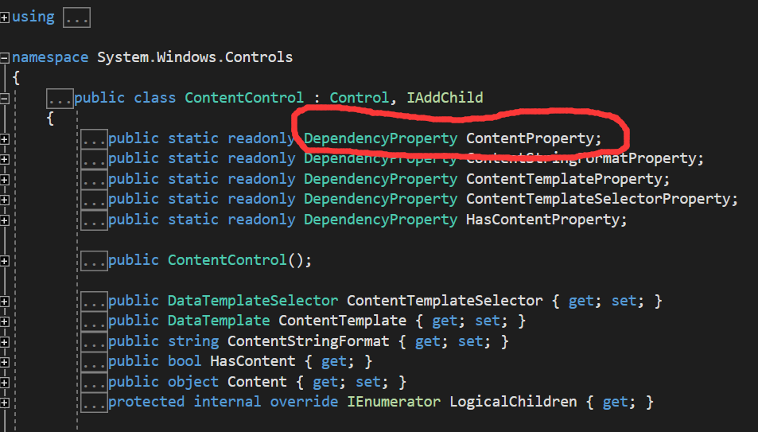
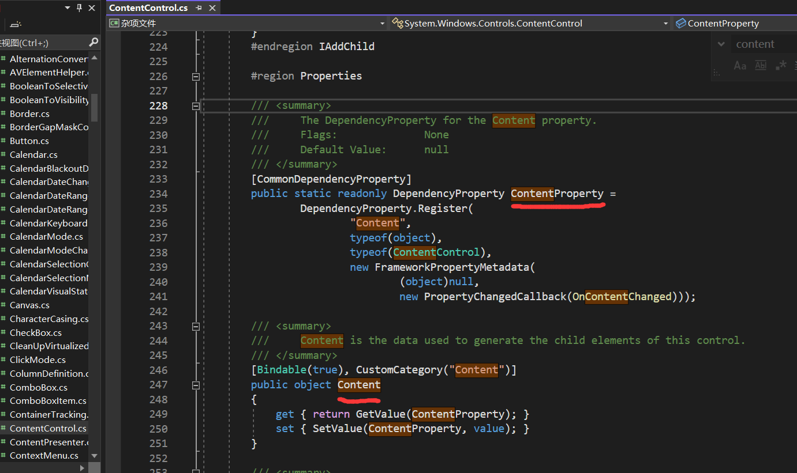
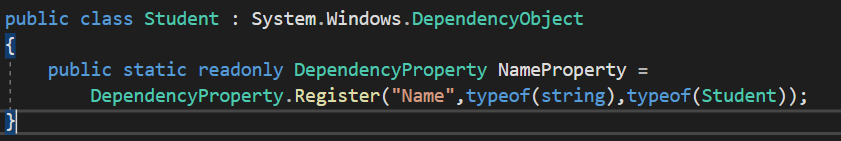
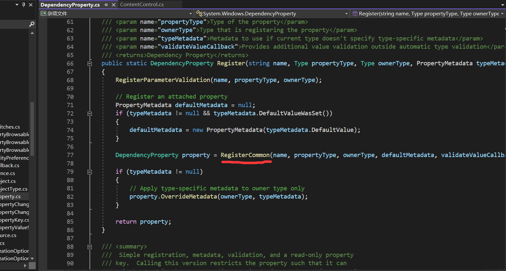
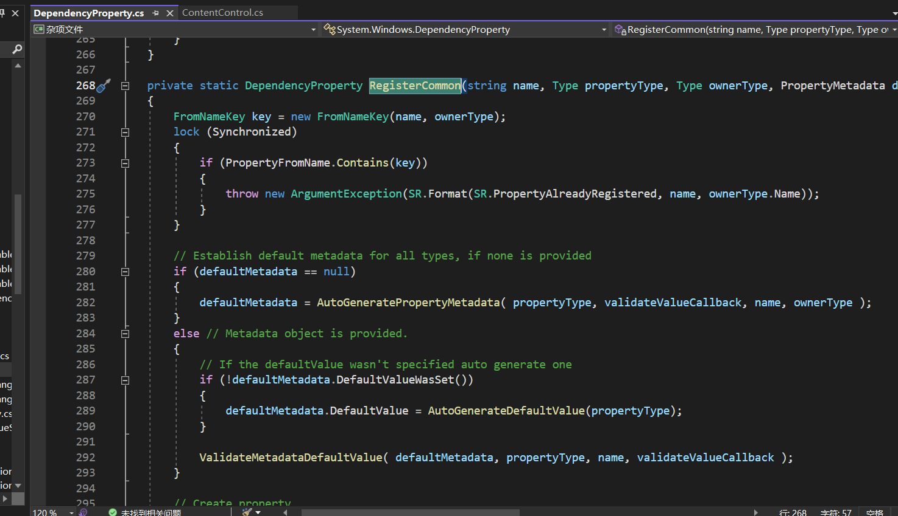
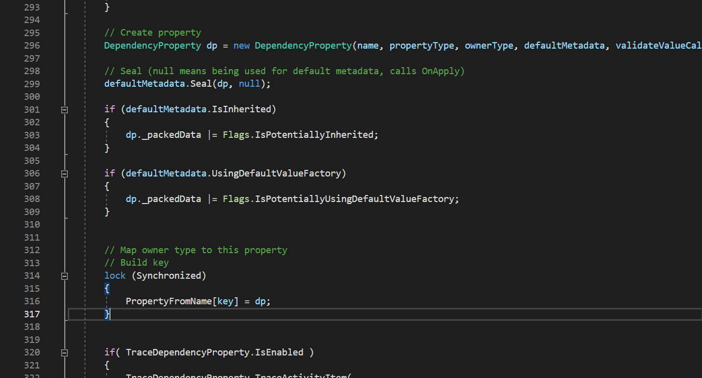
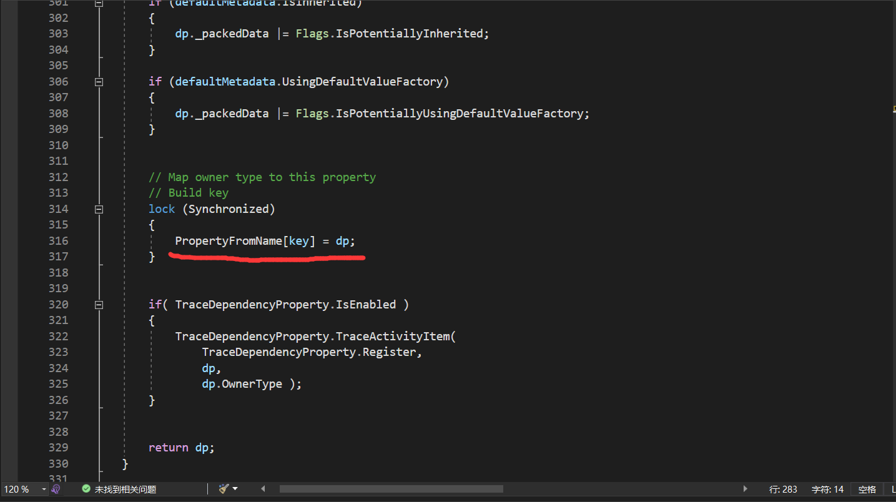
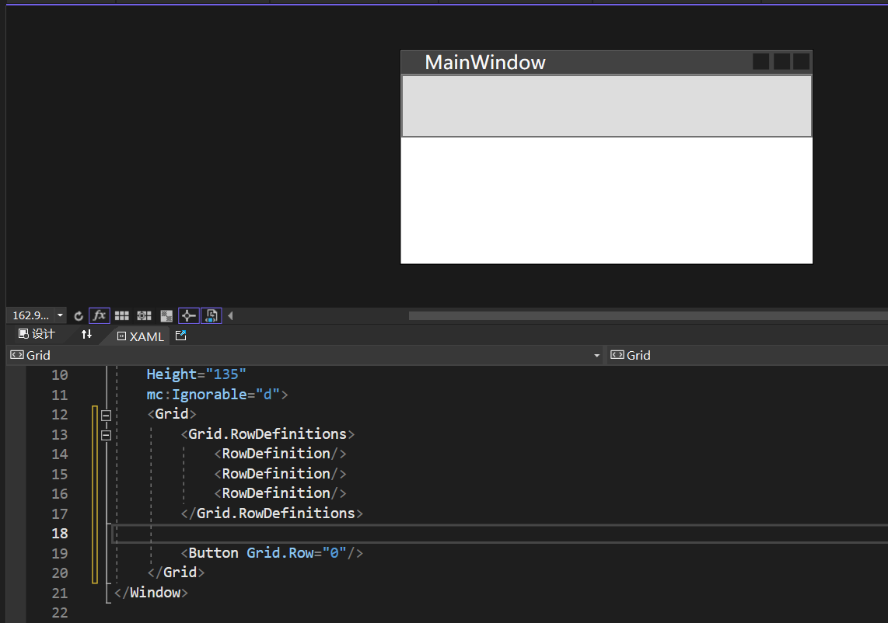
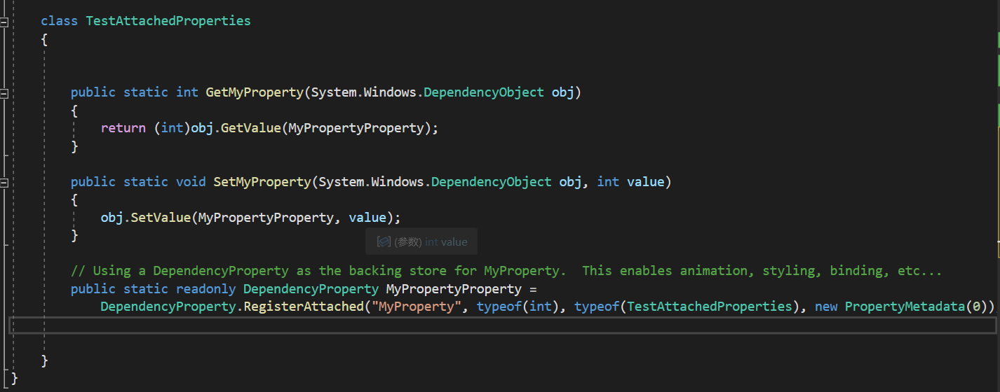

# 依赖属性

1. 为什么一个控件的某些属性支持绑定？比如一个按钮的Content属性

```xaml
<Button Content="{Binding Text}"/>
```

可以查看Button类的源码发现，发现Content属性是一个依赖属性



## 什么是依赖属性

依赖属性就是一种可以自己没有值，并能通过使用Binding从数据源获得值（依赖在别人身上）的属性。在程序中通过绑定来获取值。

* 是类的静态字段
* 只能存在于 DependencyObject 上。WPF中几乎所有的控件都继承了DependencyObject，并拥有大量的DependencyProperty
* 最终会存放在 DependencyProperty 类中的静态 HashTable 中

现实中的例子：如果去旅游，没有必要把所有的东西都带上，比如水、洗发水、沐浴露、纸、被子等等用品，其中的几个用品在酒店里都有，就没有必要自己带了，减轻压力（在程序中就是节省内存）


2. 为什么依赖属性就支持绑定？

- 依赖属性可以实现属性值的变化通知，这样就可以在数据源发生变化时，自动更新绑定的目标对象的属性值。
- 依赖属性可以实现属性值的验证和转换，这样就可以在绑定时对数据进行有效性检查和格式化处理。
- 依赖属性可以实现属性值的元数据重写，这样就可以在继承或应用样式时，改变绑定的属性的默认值或回调函数。

简而言之，依赖属性是一种支持数据驱动和UI与逻辑松耦合的属性系统，它可以通过绑定来实现数据和UI之间的交互和同步。

3. Button 类中的Content和ContentProperty依赖属性有什么关系？

打开WPF源码，可以看到：



可以发现 Content属性是通过GetValue和SetValue两个方法来获取和设置值的，并且获取和设置的是上方定义的ContentProperty依赖属性。


控件类本身有很多的属性，其中有很多的属性可能用不到，如果每次都实例化一个控件，就要在内存中开辟一块很大的空间，会浪费很多内存。在不用其中的属性时就不添加这个属性，只有在使用时才添加。


拥有依赖属性的对象被称为“依赖对象”

相比于传统的CLR属性：

* 依赖属性可以实现属性值的变化通知、限制、验证等功能，方便数据绑定和样式模板的应用。
* 依赖属性可以节约内存，因为它不需要为每个对象分配一个私有字段，而是通过一个全局的哈希表存储和获取属性值。
* 依赖属性可以支持属性值的继承、动画、元数据重写等高级特性，增强了WPF的灵活性和可扩展性。


依赖对象：

* 传统的.NET 开发中，一个对象所占用的内存空间在调用new操作符进行实例化的时候就已经决定了
* 而WPF中允许对象在创建的时候并不包含用于存储数据的空间（即字段所占用的空间），只保留在需要用到数据时能够获得默认值、借用其他对象数据或实时分配空间的能力，这种对象称为依赖对象（Dependency Object），而它这种实时获取数据的能力由依靠依赖属性（Dependency Property）来实现。在WPF中必须使用依赖对象作为依赖属性的宿主，使二者结合起来才能形成完整的Binding目标被数据所驱动。


## 依赖属性的使用



分析：

1. DependencyProperty 一定使用在 DependencyObject 里，所以 Student 类继承 DependencyObject类
2. 按照命名约定依赖属性要加上 Property后缀来区分它是一个依赖属性，NameProperty这个成员变量是一个静态只读的，在内存中只会存在一份拷贝。
3. 成员变量引用的实例并非使用new 操作符创建，而是使用DependcyProperty.Register()方法创建，这是其中一个重载。参数：
   * 第一个参数为 string类型，指明以哪个CLR属性作为这个依赖属性的包装器。依赖属性的包装器（Wrapper）是一个CLR属性，NameProperty有没有包装器这个依赖属性都存在。包装器的作用是以“实例属性”的形式向外界暴露依赖属性。这样一个依赖属性才能成为数据源的一个Path。
   * 第二个参数指明此依赖属性用来存储什么类型的值
   * 第三个参数用来指明此依赖属性的宿主是什么类型，或者说 DependencyProperty.Register()方法将把这个依赖属性注册关联到哪个类型上。

CLR属性包装了依赖属性

依赖属性即使没有CLR属性作为其外包装也可以很好地工作。

应用场景：如果创建自定义控件，其中的某个部分能够支持数据绑定，就可以使用依赖属性。

 

## 依赖属性是如何注册的

打开WPF源码，找到 DependencyProperty 类：



RegisterCommon中注册依赖属性并返回，继续进入此方法：







```C#
FromNameKey key = new FromNameKey(name, ownerType);	//生成一个唯一的Key存在 Hashtable中，WPF属性系统通过CLR属性名和宿主类型名就可以从这个全局的Hashtable中检索出对应的DependencyProperty实例。
```

注册并返回dp这个依赖属性给外部property，最终再返回给ContentProperty。

总结：依赖属性背后有一套存储机制，通过存储机制可以设置或获取它的值，避免了定义大量字段造成内存浪费的问题。

# 附加属性

附加属性：对一个对象而言，本身不具备这个属性，但由于其他的对象给了它这个属性，它就具备了这个属性。

附加属性也是依赖属性，只是定义不同。



Button按钮本身没有Grid.Row属性，是因为在Grid中才有了这个属性，Grid.Row就是Grid给Button的附加属性。

附加属性也是依赖属性，但定义不同。




参考书：《深入浅出WPF》 和 [WPF依赖属性详解](https://www.bilibili.com/video/BV1Y54y1p7n4/?spm_id_from=333.1007.top_right_bar_window_history.content.click&vd_source=87df53acb297e684ecbfc98997837a58) 视频讲解
